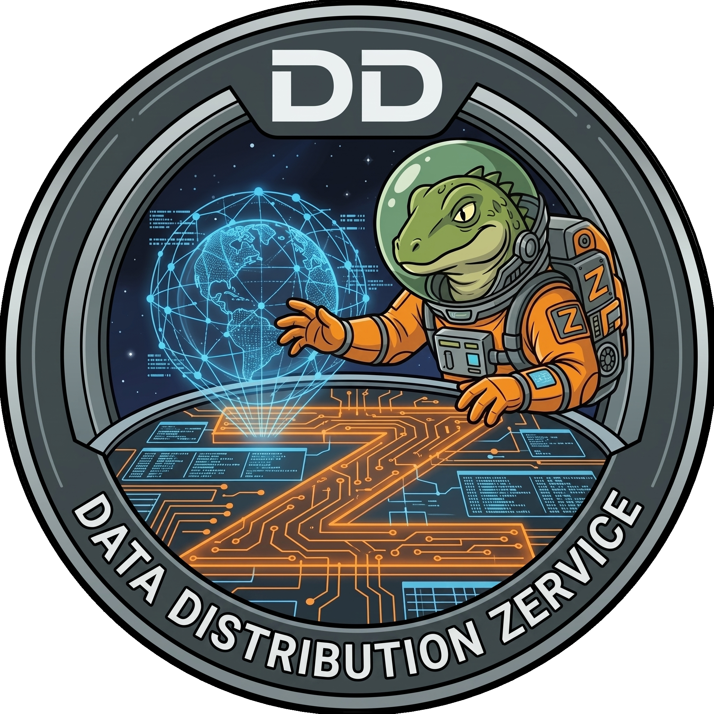

<div align="center">
  
  <h1>DDZ — Data Distribution Zervice</h1>
  <p><em>A high-performance, zero-dependency DDS &amp; RTPS implementation in pure Zig</em></p>

  [](LICENSE)
  [](https://ziglang.org/)
  [](https://www.omg.org/spec/DDS/1.4/)
  [](https://www.omg.org/spec/DDSI-RTPS/2.5/)
  
</div>

---

## Overview

**DDZ** is a ground-up implementation of the [OMG Data Distribution Service (DDS) 1.4](https://www.omg.org/spec/DDS/1.4/) specification and the [RTPS 2.5](https://www.omg.org/spec/DDSI-RTPS/2.5/) wire protocol, written entirely in [Zig](https://ziglang.org/) with **zero external dependencies**.

DDZ is designed for high-throughput, low-latency publish-subscribe middleware in robotics, sensor networks, autonomous systems, and financial trading.

### Why DDZ?

- **Pure Zig, Zero External Dependencies** — Written 100% in Zig with no C/C++ dependencies, no OpenSSL, no XML libraries, and no complex CMake/pkg-config chains. A single `zig build` builds the entire stack.
- **Comptime CDR Serialization** — Leverage Zig's compile-time reflection (`@typeInfo`) to serialize and deserialize native Zig structs directly into OMG CDR with zero runtime reflection overhead or required code generation.
- **Code-First or IDL-First Flexibility** — Develop rapidly using native Zig structs, or compile OMG IDL 4.2 schemas, ROS 2 `.msg`/`.srv` definitions, and DDS-UML XMI models using the built-in `ddz_gen` compiler.
- **Ultra-Lean & Predictable Memory** — Designed for robotics, autonomous vehicles, and embedded real-time systems with $O(1)$ HistoryCache eviction, memory-pooled per-instance chains, and bounded queues.
- **Zero-Copy Shared Memory IPC** — High-performance local inter-process communication that bypasses the network stack using native OS memory-mapped shared memory (Windows & POSIX).
- **Comprehensive Standards Ecosystem** — Full DDS 1.4 PIM (all 22 QoS policies), RTPS 2.5 wire protocol, X-Types 1.3 schema evolution, SQL92 content filtering, DDS-XML zero-code deployment, DDS-JSON payloads, and DDS-RPC.

### Key Features

- **Full DDS 1.4 PIM** — All 22 QoS policies, WaitSets, Conditions, Listeners, and strict Request vs Offered (RxO) compatibility negotiation
- **RTPS 2.5 Wire Protocol** — DATA, DATA_FRAG, HEARTBEAT, HEARTBEAT_FRAG, ACKNACK, NACK_FRAG, SPDP/SEDP discovery
- **Comptime & IDL Serialization** — Zero-overhead serialization via Zig's `@typeInfo` metaprogramming, plus full OMG IDL 4.2 compilation via `ddz_gen`
- **Zero-Copy Shared Memory** — Bypasses the kernel UDP stack for local IPC via OS memory-mapped files (Windows & POSIX)
- **O(1) History Cache** — Memory-pooled doubly-linked list with per-instance chains for instant KEEP_LAST eviction
- **Lock-Free WaitSets** — SPSC ring buffer signal delivery with atomic spinlock synchronization
- **DDS Security** — X25519 ECDH authentication, AES-256-GCM encryption, XML access control
- **X-Types 1.3 & Dynamic Data** — Schema evolution (`MUTABLE`, `APPENDABLE`, `FINAL`), TypeLookup Service, and runtime types (`Union`, `Map`, `Bitset`, `Optional`, `Array`)
- **SQL92 Content-Filtered Topics** — Writer-side and reader-side filtering (`BETWEEN`, `LIKE`, `IN`, `NOT IN`) with dynamic `%0` expression parameter mutation
- **Multi-Topics** — SQL JOIN across multiple topics at runtime
- **RPC over DDS** — Request/Reply pattern with SampleIdentity correlation and auto-generated client stubs / server skeletons
- **Persistent Durability** — HistoryCache serialization to disk for cross-session data survival
- **Zero-Code XML Deployment (DDS-XML)** — Pure Zig memory-efficient XML pull-parser and profile-based entity factory instantiation
- **Standardized JSON Encoding (DDS-JSON)** — RFC 8259 compliant encoding via `DataRepresentationQosPolicy` for telemetry bridges
- **DDS-UML Tooling** — Ingest OMG XMI UML models and generate Zig architecture topology, topic structs, and OMG IDL
- **CLI Diagnostics** — Integrated `ddz_ping` for round-trip latency benchmarking and `ddz_spy` for real-time packet sniffing and discovery dissection

### Specification Compliance

DDZ implements all 22 QoS policies defined in the OMG DDS 1.4 specification:

> Reliability · History · Durability · Durability Service · Deadline · Lifespan · Liveliness · Ownership · Ownership Strength · Destination Order · Resource Limits · Time-Based Filter · Writer Data Lifecycle · Reader Data Lifecycle · Presentation · Partition · User Data · Group Data · Topic Data · Latency Budget · Transport Priority · Entity Factory

---

## Getting Started

### Prerequisites

- [Zig compiler](https://ziglang.org/download/) `0.17.0-dev` or later

### Installation

Add DDZ as a dependency to your Zig project:

**1. Fetch the dependency:**

```bash
zig fetch --save git+https://github.com/0xGodyr/ddz.git
```

**2. Add to your `build.zig`:**

```zig
const ddz_dep = b.dependency("ddz", .{
    .target = target,
    .optimize = optimize,
});
exe.root_module.addImport("ddz", ddz_dep.module("ddz"));
```

### Quick Start

```zig
const std = @import("std");
const ddz = @import("ddz");

const SensorData = struct {
    sensor_id: u32,
    temperature: f32,
};

pub fn main() !void {
    const allocator = std.heap.page_allocator;

    // 1. Create a DomainParticipant on Domain 0
    var factory = ddz.dcps.DomainParticipantFactory.getInstance();
    var participant = try factory.createParticipant(0, null, allocator);
    defer factory.deleteParticipant(participant, allocator) catch {};
    try participant.enable();

    // 2. Create Publisher & Subscriber
    var publisher = try participant.createPublisher(null);
    var subscriber = try participant.createSubscriber(null);

    // 3. Define a Topic
    const topic = ddz.dcps.Topic.init("SensorTopic", "SensorData");

    // 4. Create Writer & Reader
    var writer = try publisher.createDataWriter(topic, .{}, ddz.rtps.types.EntityId_t.unknown);
    var reader = try subscriber.createDataReader(topic, .{}, ddz.rtps.types.EntityId_t.unknown);

    // 5. Write data
    try writer.write(SensorData{ .sensor_id = 1, .temperature = 23.5 });
    try writer.flush();

    // 6. Read data
    const samples = try reader.take(SensorData, 10, .any, .any, .any);
    defer reader.returnLoan(SensorData, samples);

    for (samples) |sample| {
        std.debug.print("Sensor {d}: {d:.1}°C\n", .{ sample.data.sensor_id, sample.data.temperature });
    }
}
```

---

## Building from Source

```bash
# Build the library and all executables
zig build

# Run all unit tests
zig build test --summary all

# Run diagnostic & codegen CLI tools
zig build run-ddz_ping -- --help
zig build run-ddz_spy -- --help
zig build run-ddz_gen -- --help

# Run a specific example
zig build run-hello_world
zig build run-comprehensive
zig build run-idl_interop
zig build run-rpc
```

---

## Examples

DDZ ships with 19 runnable examples demonstrating different features:

| Example | Command | Description |
|---|---|---|
| Hello World | `zig build run-hello_world` | Minimal pub/sub with take |
| Comprehensive | `zig build run-comprehensive` | Multi-QoS integration test |
| Built-in Topics | `zig build run-builtin_topics` | Discovery inspection via SEDP readers |
| Content Filtered | `zig build run-content_filtered_topics` | SQL-like writer-side filtering |
| Dynamic Data | `zig build run-dynamic_data` | Schema-less DynamicValue and TypeObject API |
| Group Access | `zig build run-group_access` | Coherent + ordered access |
| IDL Interop | `zig build run-idl_interop` | OMG IDL 4.2 generated struct pub/sub and RPC |
| Lifecycle | `zig build run-lifecycle` | Data lifecycle QoS (dispose/unregister) |
| Manual Liveliness | `zig build run-manual_liveliness` | Manual liveliness assertion & lease expiration |
| Multi-Topic | `zig build run-multi_topic` | SQL JOIN across topics |
| Ownership | `zig build run-ownership` | Exclusive ownership arbitration |
| Partition QoS | `zig build run-partition_qos` | Namespace isolation with globs |
| Persistent | `zig build run-persistent_durability` | Cross-session disk persistence |
| Deadline QoS | `zig build run-qos_deadline` | Deadline enforcement |
| Durability QoS | `zig build run-qos_durability` | Late-joiner support |
| RPC | `zig build run-rpc` | Request/Reply pattern |
| Security | `zig build run-security` | Auth + encryption + access control |
| Time-Based Filter | `zig build run-time_based_filter` | Rate decimation via minimum separation |
| WaitSet StatusCondition | `zig build run-waitset_status_condition` | Async matching and WaitSet unblocking |

---

## Project Status

> **⚠️ Alpha** — DDZ is under active development. The core DDS 1.4 PIM and RTPS wire protocol are implemented, verified, and cross-platform. The API may evolve between versions.

### What Works

- ✅ All 22 DDS 1.4 QoS policies with strict Request vs Offered (RxO) compatibility negotiation
- ✅ SPDP/SEDP peer-to-peer discovery with XTypes assignability verification
- ✅ Reliable and best-effort delivery with fragment retransmission (NACK_FRAG / HEARTBEAT_FRAG)
- ✅ Message fragmentation and reassembly
- ✅ WaitSets, ReadConditions, StatusConditions, and QueryConditions with dynamic parameter substitution
- ✅ Content-Filtered Topics with dynamic expression parameters and full SQL92 syntax (`IN`, `BETWEEN`, `LIKE`)
- ✅ Multi-Topics with SQL JOIN across streams
- ✅ Shared memory zero-copy transport (Windows & POSIX)
- ✅ DDS Security (authentication, encryption, access control)
- ✅ X-Types 1.3 schema evolution (`MUTABLE`/`APPENDABLE`/`FINAL`) & TypeLookup Service
- ✅ DynamicData runtime support for `Union`, `Map`, `Bitset`, `Optional`, and `Array`
- ✅ RPC over DDS (Requester / Replier) with automated stubs and skeletons
- ✅ Standalone OMG IDL 4.2 compiler (`ddz_gen`) with C preprocessor, ROS 2 `.msg`/`.srv` bridge, and reverse IDL codegen
- ✅ UML Profile for DDS (`ddz_gen --xmi`) architecture topology and IDL generation
- ✅ Zero-code DDS-XML application creation engine (`DomainParticipantFactory.createParticipantFromConfig`)
- ✅ DDS-JSON payload serialization & `DataRepresentationQosPolicy`
- ✅ Diagnostic tools: `ddz_ping` (latency/throughput) & `ddz_spy` (live packet sniffer)
- ✅ Cross-platform: Windows, Linux (x86_64), macOS (ARM64)

### Known Limitations

- **Multi-Vendor Physical Network Testing** — Automated unit and localhost network loopback tests pass; full end-to-end testing across physical mixed-OS networks with external vendor stacks is an ongoing initiative.
- **WAN & NAT Traversal (DDS-TCP)** — Currently bound to UDPv4 unicast/multicast and local OS Shared Memory (SHM). RTPS-over-TCP and STUN/TURN traversal are planned for post-alpha releases.
- **Programmatic DynamicTypeBuilder API** — Runtime `DynamicData` reflection and `TypeObject` introspection are fully functional; the programmatic fluent builder factory interface is scheduled for a future milestone.
- **Hardware Security Modules (HSM)** — Cryptographic authentication and encryption run via pure Zig software engines (X25519, AES-256-GCM); PKCS#11 hardware token integration is planned.

---

## Documentation

- **[Examples Catalog](examples/README.md)** — Index and source code for all 19 runnable examples
- **[DDZ Code Generator (`ddz_gen`)](tools/ddz_gen/README.md)** — Standalone OMG IDL 4.2 compiler & ROS 2 bridge documentation
- **[Latency Benchmark (`ddz_ping`)](tools/ddz_ping/README.md)** — Round-trip latency and throughput benchmark CLI documentation
- **[Network Sniffer (`ddz_spy`)](tools/ddz_spy/README.md)** — Terminal-based packet sniffer and discovery dissection CLI documentation

---

## Contributing

Contributions, issues, and feature suggestions are welcome! Feel free to open an issue or submit a pull request on GitHub.

## License

This project is licensed under the MIT License — see the [LICENSE](LICENSE) file for details.

---

<div align="center">
  <sub>Built with ❤️ in Zig</sub>
</div>
